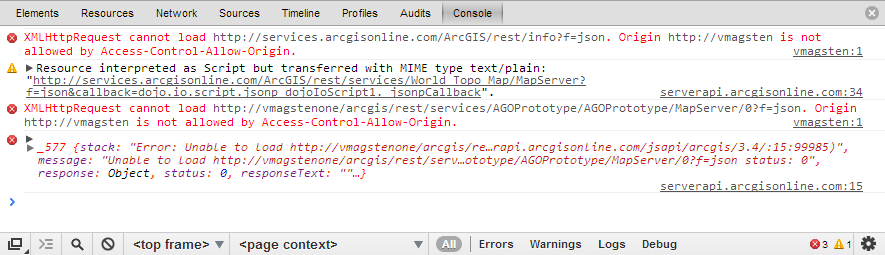
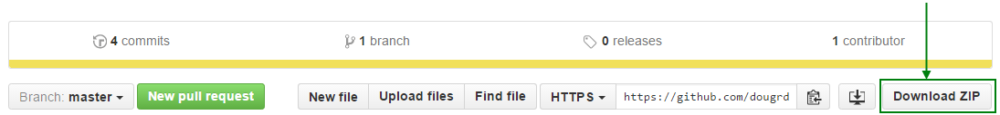

# Simple API Proxy

This is a simple web API proxy, which can be used to forward API calls from one URI to another,
through the node Express web server.  I've used this in personal projects to avoid issues with
[CORS](https://developer.mozilla.org/en-US/docs/Web/HTTP/Access_control_CORS), especially in
proof-of-concept designs or quickstarters.

If you see this error in Chrome, this project may help you:

# Prerequisites

Ensure Node is installed.  See [nodejs.org](https://nodejs.org/en/).

# Download

Download this project.  The easiest way is to click the "Download Zip" button above:

Once downloaded, unzip the project.

# Installation

Open a command prompt and navigate to the folder where the project was unzipped.

Then, run `npm install`

# Running the proxy server

Run `npm start -- --proxy=http://path/to/api`

Note the `--` option is present to correctly pass parameters to the node script.

For more complex options, the following parameters are available:

`--path=/local/path/to/forward/to/api/*` - Defaults to `/*` to forward all calls.  
`--proxy=http://path/to/api` - Required, the path to the web API that you're proxying.  
`--port=3002` - Defaults to 3002, the port assigned to the proxy.  

## For example:

Running `npm start -- --proxy=http://mywebsite.com/api --port=60001 --path=/api/*` would:

1.  Start the proxy server at port 60001.
2.  Forward all calls starting with http://localhost:60001/api to http://mywebsite.com/api.

# Making API calls to proxy

Once the proxy is running, you can direct all calls to it rather than another server.

For example, if you were originally issuing a `GET` request to `http://some/other/api/customers`
to get a list of customers, you would first run a server like this:

`npm start -- --proxy=http://some/other/web/api`

Then, you can issue a `GET` request to `http://localhost:3002/customers`, and the API call
will be passed through the server to `http://some/other/api/customers` and return a
CORS-enabled response.
